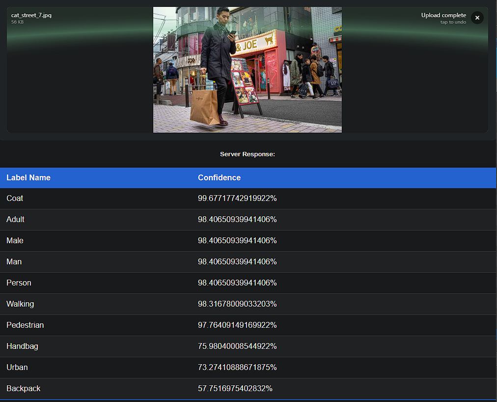
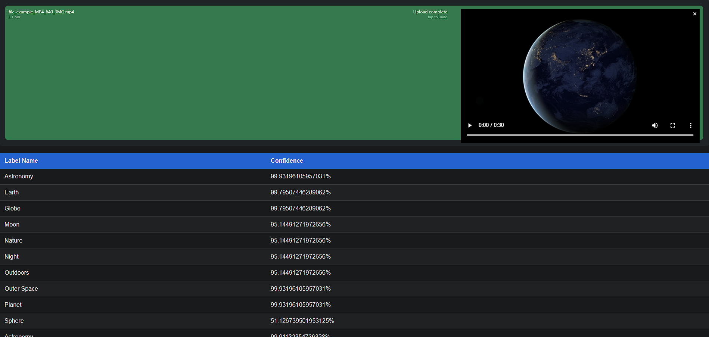

# Full-Stack Media Labeling App

A small web application that allows users to upload an image and a video, which are then analysed using **Amazon Rekognition** to detect labels. The results should be displayed on the frontend. It should also be possible to view the image and the video.

Stack: ReactJS; Pythom, AWS Lambda; AWS S3 Bucket; AWS Rekognition; NodeJS;

## POC
### Image result


### Video result


## Features

- **Frontend (ReactJS)**: 
  - Allows users to upload images and videos.
  - Displays the uploaded file and the detected labels after analysis.
  
- **Backend (FastAPI - Python)**:
  - Receives the uploaded files from the frontend.
  - Sends files to an **AWS Lambda** function for processing.
  - Saves the file to **AWS S3** and invokes **AWS Rekognition** for label detection.
  - Stores the detected labels in a local **SQLite3** database for caching, reducing re-analysis time.

- **AWS Lambda**:
  - Handles the media file upload to S3 and invokes Rekognition for label analysis.
  
- **SQLite3**:
  - Used to cache labels locally for faster retrieval on subsequent requests for the same file.

## Architecture

1. **Frontend (ReactJS)**:
   - Users upload media (image or video) through the FilePond uploader.
   - The frontend sends the media to the backend API.
   
2. **Backend (FastAPI)**:
   - Handles file uploads and manages interactions with AWS services (S3, Rekognition).
   - Saves labels in SQLite3 as a cache.
   - Returns detected labels back to the frontend.
   
3. **AWS Lambda**:
   - Receives the file, stores it in an S3 bucket, and processes it with AWS Rekognition.
   - Sends back the labels for analysis.

## Demo

- The app runs **locally** for the demo, but the architecture is designed to be deployed to **AWS Cloud**.
- **Frontend** is served by ReactJS.
- **Backend** is a Python-based FastAPI server running locally.
- The app connects to **AWS S3** for storage and **AWS Rekognition** for label detection.

## Installation

### 1. Frontend (ReactJS)
```bash
cd frontend
npm install
npm run start
```

### 2. Backend (FastAPI)
``` bash
cd backend
pip install -r requirements.txt
python app.py
```


### 3. AWS Setup
Create an S3 bucket in AWS.
Set up AWS Rekognition for label detection.
Configure an AWS Lambda function to handle media processing.
Create topics, notifications, roles, policies to handle requests for the lambda function.

## Future Deployment
* User uploads a file through the frontend.
* Backend stores the file in AWS S3.
* Lambda function analyzes the file using Rekognition and returns labels.
* Labels are cached in SQLite3.
* Frontend displays the labels under the media file.

## Caching
To prevent unnecessary Rekognition calls, the application stores labels in SQLite3. If the same file is uploaded again, the cached labels are returned directly from the database.

## Tech stack 
* Frontend: ReactJS, FilePond
* Backend: FastAPI (Python)
* AWS: Lambda, Rekognition, S3
* Database: SQLite3
* Deployment: AWS S3, EC2, Amplify (Optional)